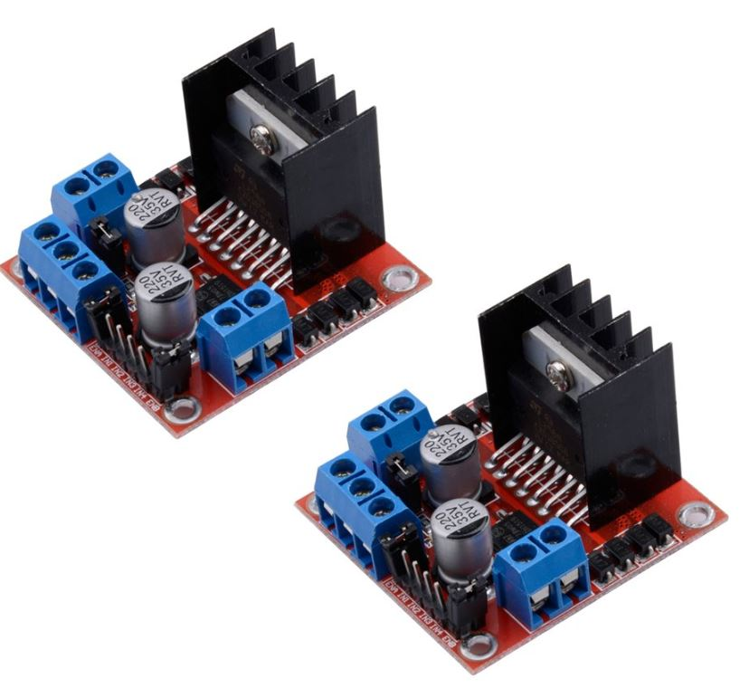
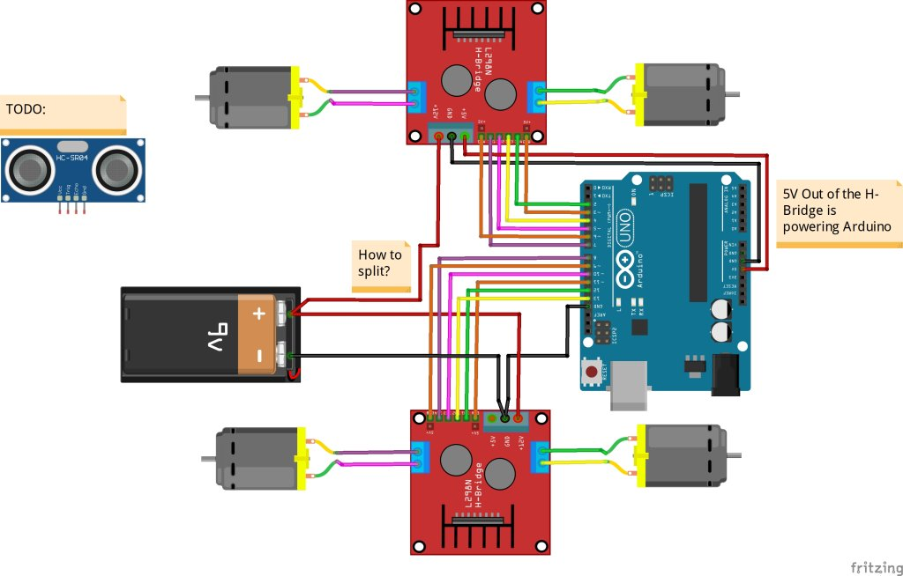
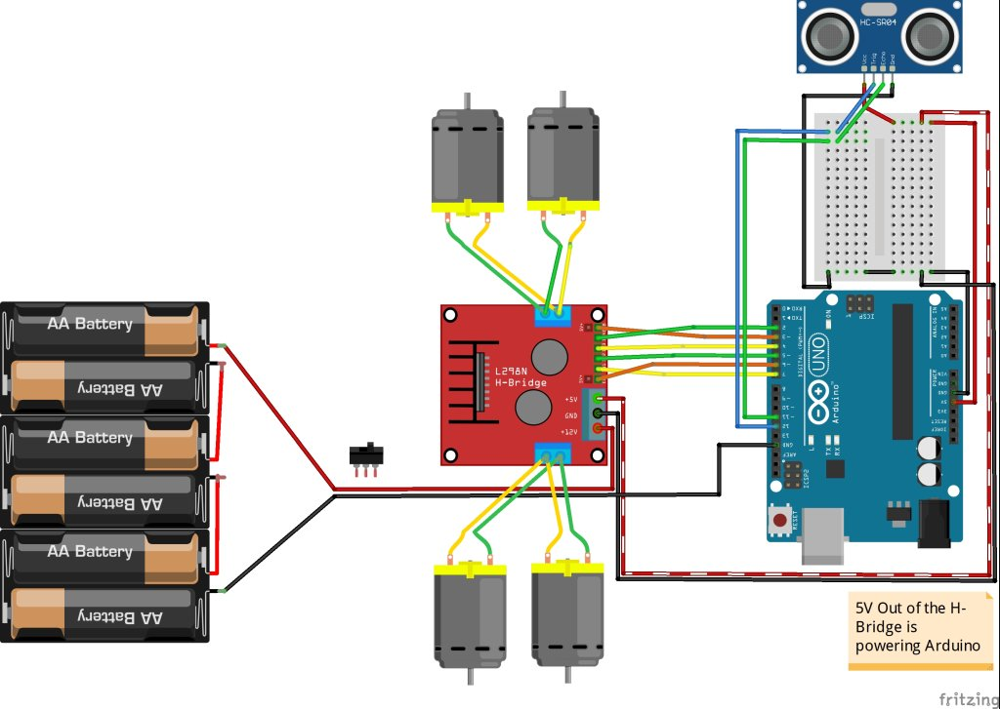

# Description
This project puts together an obstacle-avoiding self-driving robot car. At a later stage I will also upgrade it to receive control over Bluetooth phone-joystick and to turn on and off headlights based on light conditions.

# Parts used
## Chassis kit
Contains basic car chassis, motors, wheel and tyres and a not very useful 4 x 1.5V AA battery holder.

[](https://www.amazon.com/gp/product/B07DNXBFQN)

The information I have about the motors is:

```
Q: How powerful are the wheel motors individually (i.e., RPMs, amps, max. speed, torque, etc.)?
A: Its speed is 200 rpm. Torque is 0.68. current is 90 mA. All parameter are tested without loading.
```

I have actually measured the motor usage at 180 mA without any loads.

```
Q: Does this meet these specifications:brushed [versus brushless] dc motors 5v-9v 100ma to 500 ma with tires and integrated gearbox?
A: Its motor power supply is 3V ~ 6V without without load.
```

Wires need soldering to the motors. The battery holder is useless because you cannot power the bridges with 6V.

## L298N H-Bridge(s)
[](https://www.amazon.com/gp/product/B01M29YK5U)

Here's some very useful information about them:
- [Link 1](https://dronebotworkshop.com/dc-motors-l298n-h-bridge/)
- [Link 2](https://www.14core.com/wiring-driving-the-l298n-h-bridge-on-2-to-4-dc-motors/)

I know they're considered ancient and inefficient, but I chose them because there's a ton of information and tutorials out there about them.

Key take-aways:
- Needs around 7.5V to power up
- Can provide regulated 5V out, which can be used to power the Arduino
- Will drop 1.4-1.7V, or more (inefficiency)
- Has a 5V jumper in place: jumper in - you provide 7.5V to the H-Bridge and it outputs 5V, otherwise you have to provide the 5V as logical input
- You can provide PWM to the Enable pin, to control speed of the motor
- Make sure you have a common ground with the Arduino

Not sure if they regulate the voltage passed to the motors, I think not. So if you have a 3~6V motor, you'd probably want to pass no more than `6V + 1.4V` to the H-Bridge, which will drop the voltage down to 6V for the motor.

## Wires
I am going to use a combination of [jumper wires](https://www.amazon.com/gp/product/B07GD2BWPY) and a stripped CAT5 cable.

## Power
[6x holder](https://www.amazon.com/gp/product/B081395LK3) of 1.2V AA NiMH recharchable batteries (rated 2000mAh each) = 7.2V

## Sensors
- Ultrasonic (to detect and avoid obstacles)

## Others
- [Spacers/standoffs, to be able to put the components on to the chassis](https://www.amazon.com/gp/product/B073ZC6PB9)

## TODO:
Sensors and parts to be added at a later stage:
- Ultrasonic (to detect and avoid obstacles)
- Servo (to rotate Ultrasonic sensor)
- Bluetooth (to receive control over bluetooth phone joystick) or IR (take commands from remote control)
- Photoresistor (to turn on/off LED headlights)
- Screen to show misc information

# Wiring
Click image to download `fzz` file.

## 4WD, 2 Bridges
### Pros
- Each tyre could go in a different direction, individually. Not sure if this helps a lot for turning left and right.
- Maybe would put less load on the bridge

### Cons
- Takes up almost all of my Arduino pins (2 bridges x 2 motors each x 3 wires = 12 pins!)
- Will have to split red wire to power both bridges
- Will lose symmetry (one of the bridges will power the Arduino)
- Might be more power-hungry? Not sure yet.
- Takes more wiring
- Requires more coding

[](ObstacleCar_2_Bridges_4wd.fzz)

## 4WD, 1 Bridge
### Pros
- Will require only 6 pins on the Arduino
- A bit less coding
- Symmetry

### Cons
- Left side and right side motors are 'grouped' (i.e. both wheels on each side can only go in the same direction)

[](ObstacleCar_1_Bridge_4wd.fzz)

# Code
**Work in progress ...**

See [RoboCar.ino](../RoboCar/RoboCar.ino)